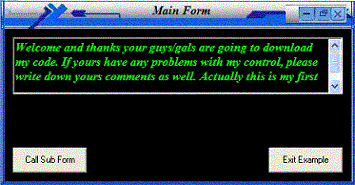

<div align="center">

## CoolWindow


</div>

### Description

Actually This is a custom control window.. we can change the background colour of a window, caption font size and etc.... That mean esay we can have a coolwindow by just setting up it's properties..
 
### More Info
 
Take a look at it's properties

No..

During your development time, if you want to resize it's and you must click on it and drag it's to a side and then click on the your form and resize your form.... It's will automatically follow the size of your form.


<span>             |<span>
---                |---
**Submitted On**   |2004-03-03 23:06:58
**By**             |[Joshua Kan Wing Yean](https://github.com/Planet-Source-Code/PSCIndex/blob/master/ByAuthor/joshua-kan-wing-yean.md)
**Level**          |Beginner
**User Rating**    |4.6 (37 globes from 8 users)
**Compatibility**  |VB 5\.0, VB 6\.0
**Category**       |[OLE/ COM/ DCOM/ Active\-X](https://github.com/Planet-Source-Code/PSCIndex/blob/master/ByCategory/ole-com-dcom-active-x__1-29.md)
**World**          |[Visual Basic](https://github.com/Planet-Source-Code/PSCIndex/blob/master/ByWorld/visual-basic.md)
**Archive File**   |[CoolWindow1720283152004\.zip](https://github.com/Planet-Source-Code/joshua-kan-wing-yean-coolwindow__1-52385/archive/master.zip)

### API Declarations

```
Const WM_NCLBUTTONDOWN = &HA1
Const HTCAPTION = 2
Private Declare Function SendMessage Lib "user32" Alias "SendMessageA" (ByVal hwnd As Long, ByVal wMsg As Long, ByVal wParam As Long, lParam As Any) As Long
Private Declare Sub ReleaseCapture Lib "user32" ()
Private Declare Function GetCursorPos Lib "user32" (lpPoint As PointAPI) As Long
```


